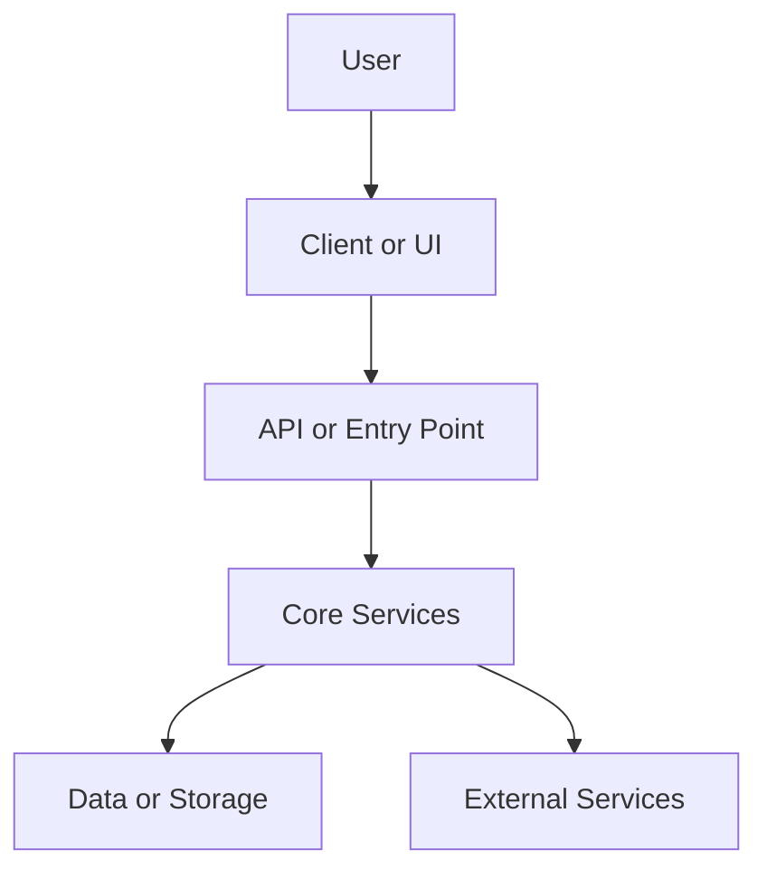

# Project Brief

## One-Sentence Summary

What this project does, for whom, and why it matters.

## How To Run Or Inspect

- Requirements:
- Main commands:
- Important environment variables:

## Architecture Map

- Entry point:
- Frontend/UI:
- Backend/API:
- Data model/storage:
- Tests:
- Configuration/deployment:

## Main Flow

Describe one important feature from user action or input through the relevant files to the final output.

## Tech Stack

- Languages:
- Frameworks:
- Database/storage:
- Tooling:

## Evidence Map

| Claim | Evidence | Confidence |
|-------|----------|------------|
|       |          |            |

## Strengths, Risks, And Improvements

Strengths:

- 

Risks:

- 

Improvement opportunities:

- 

## Interview Pitch

30-second version:

1-minute version:

3-minute version:

Technical highlights:

Tradeoffs and improvements:

Likely questions:

## Reading Plan

1. 
2. 
3. 

## Uncertainties

What still needs to be verified.

## Verification Status

- Commands run:
- Tests run:
- Not run:
- Why not:
